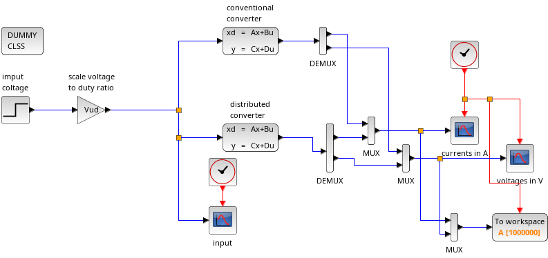

# Current-Mode Control of a Distributed Buck Converter with a Lossy Transmission Line

This project contains the Scilab source files for the simulation of a distributed buck cenverter with a lossy transmission line.

Röbenack, K.; Gerbet, D.:   
*Current-Mode Control of a Distributed Buck Converter with a Lossy Transmission Line*.   
Submitted to MDPI Electronics, June 2024.

## Prerequisites

You need to install the open source software Scilab. This software for engineers and scientifsts is available for several operating systems:

https://www.scilab.org/

Our simulations were carried out with Scilab 2024.

## Contents

The [src](src) directory contains the source Scilab and Xcos files.

### Parameters and Constants

The file [src/context.sce](context.sce) contains the parameter values and constants for the simulation. It is called by the other script files.

### Step Response

   

## Licence

This project is licensed under the GNU General Public License v3.0 - see the [LICENSE](LICENSE) file for details.

