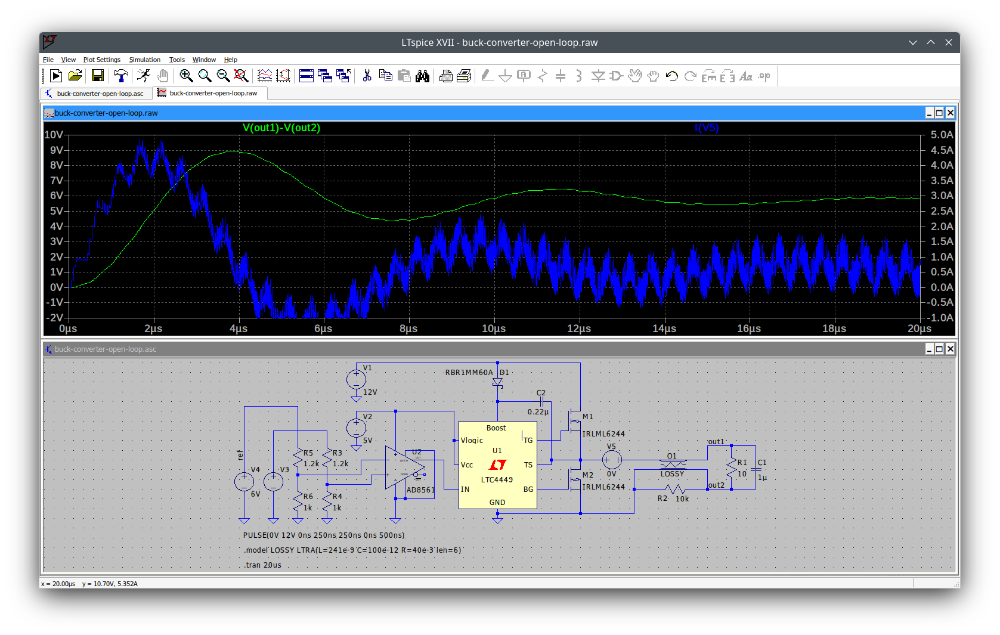

# Current-Mode Control of a Distributed Buck Converter with a Lossy Transmission Line

This project contains the Scilab source files for the high level simulation of a distributed buck converter with a lossy transmission line. In addition, we provided the details for a circuit simulation using LTspice&reg; from Amalog Devices Inc.

Röbenack, K.; Gerbet, D.:   
*Current-Mode Control of a Distributed Buck Converter with a Lossy Transmission Line*.   
Submitted to MDPI Electronics, June 2024.

## Prerequisites

You need to install the open source software Scilab. This software for engineers and scientists is available for several operating systems:

<https://www.scilab.org/>

Our simulations were carried out with Scilab 2024.

The circuit simulations were carried out with LTspice&reg;:

<https://www.analog.com/en/resources/design-tools-and-calculators/ltspice-simulator.html>

## Contents

The [src](src) directory contains the source Scilab and Xcos files as well as the schematics files.

### Parameters and Constants

The file [context.sce](src/context.sce) contains the parameter values and constants for the simulation. It is called by the other script files.

### Step Response

The Scilab script file [sim-step.sce](src/sim-step.sce) calls the Xcos scheme [sim-step.zcos](src/sim-step.zcos). 

   

### PWM Excitation

The Scilab script file [sim-pwm.sce](src/sim-pwm.sce) calls the Xcos scheme [sim-pwm.zcos](src/sim-pwm.zcos).  

   

### Open Loop Circuit Simulation

Transient simulation with 6V reference voltage.

   

Transient simulation with 6.144V reference voltage.

   

### Closed Loop Circuit Simulation

Transient simulation with P controller.

   

Transient simulation with PI controller.

   

### Frequency Responses

The Scilab script file [bode1.sce](src/bode1.sce) visualizes the amplitude frequency responses for the different converter models:

   

The Scilab script file [bode2.sce](src/bode2.sce) visualizes the open loop amplitude frequency responses for the conventional converter with and without controller:

   

## Licence

This project is licensed under the GNU General Public License v3.0 - see the [LICENSE](LICENSE) file for details.

